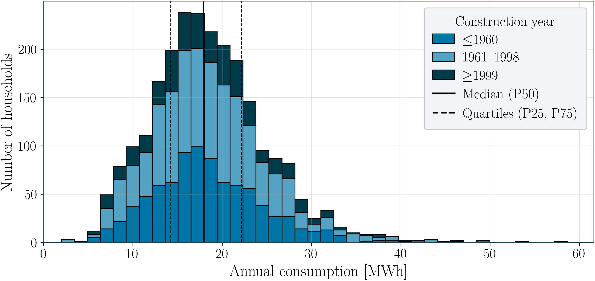
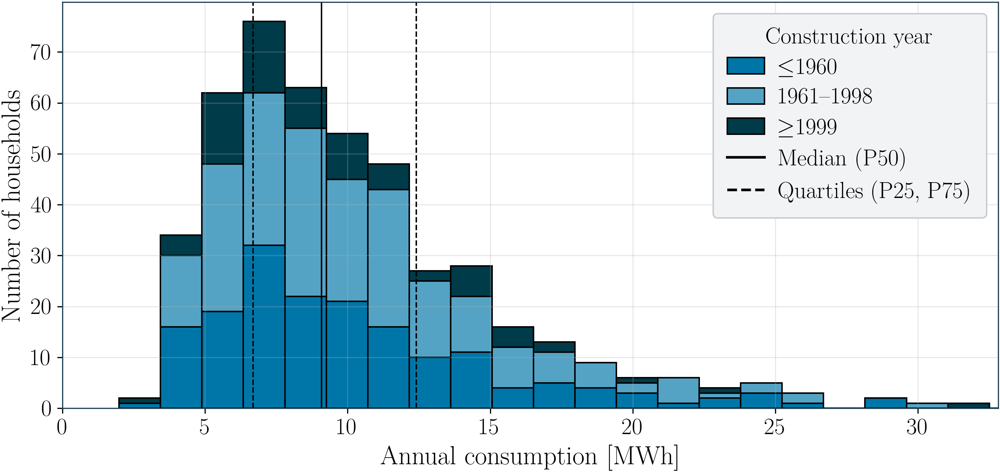

# Specific Heat Load Profiles for Residential Consumers in District Heating Networks

High-resolution, context-aware load profiles for district heating cunsumers based on a gradient boosting approach, considering two building types and three construction year categories.

## Overview

This repository contains aggregated time series and engineered feature datasets for district heating customers from Aalborg.

### Data sources

- **Smart heat meter consumption & building context metadata**:  
  Schaffer, M., Tvedebrink, T., & Marszal-Pomianowska, A. *Three years of hourly data from 3021 smart heat meters installed in Danish residential buildings*. Scientific Data, 9, 420 (2022).  
  Data published under **CC BY 4.0** (http://creativecommons.org/licenses/by/4.0/). DOI: 10.5281/zenodo.6563114

- **Outdoor air temperature (hourly)**:  
  Danish Meteorological Institute (DMI) Open Data.  
  Data published under **CC BY 4.0** (http://creativecommons.org/licenses/by/4.0/).  
  Documentation: https://opendatadocs.dmi.govcloud.dk/en/DMIOpenData

The key idea is to provide load profiles **transferable** by conditioning them on **building context metadata**:

- **Building type**
- **Construction year category**
- **Annual consumption bands** 

---

## Generated datasets

We export datasets at different aggregation levels:

1. **All customers (full dataset)**  
   Includes single-family houses, terraced houses and additional building types (all available customers).

2. **By building type**
   - Single-family houses 
   - Terraced houses

3. **By building type + construction year category**
   - **≤ 1960**
   - **1961–1998**
   - **≥ 1999**

4. **By building type + construction year categorie + annual consumption band**  
   Thresholds for consumption bands are defined by type-specific percentiles of annual consumption.

### Consumption percentiles (annual consumption in MWh)

| Building type | P25  | P50  | P75  |
|---|---:|---:|---:|
| SFH | 14.15 | 17.97 | 22.18 |
| TH  | 6.65  | 8.91  | 12.25 |

### Annual consumption and construction year distributions

**Single-family houses**



**Terraced houses**



> Each exported dataset comprises:
> - an **aggregated consumption time series** (hourly)
> - an **oudoor air temperature time series** (hourly)
> - a **feature dataset** derived from it (calendar + temperature features, etc.)

---

## File naming convention

Each file encodes the selection criteria.

Example:

```text
aggregated__consumertype_single_family_house__consumption_14p5-17p97MWh__constructionyear_≤1960__cluster_all__n0216__features__temp_hourly.csv
```
Meaning:
- `consumertype_single_family_house` → building type filter
- `consumption_14p5-17p97MWh` → annual consumption band (MWh); decimal values use `p` as separator
- `constructionyear_≤1960` → construction year class
- `cluster_all` → no further clustering inside the selection (single group export)
- `n0216` → number of households/files included in this aggregated consumption dataset
- `features__temp_hourly` → feature dataset using hourly temperature mode


